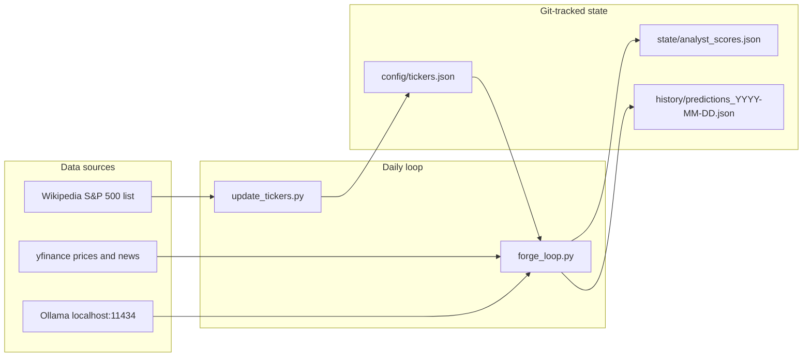

# OracleForge

A daily research pipeline that runs multiple **local Ollama models** against S&P 500 equities. Each model predicts the next session's **High of Day (HOD)** from the latest close and news headlines. Prior predictions are scored with a simple simulated take-profit / stop-loss rule, and all state is stored as JSON in this repository.

This project does **not** place live trades. It produces predictions and a model leaderboard for experimentation.

## How it works



**`forge_loop.py`** runs in three phases:

1. **Market data and scoring** — Fetches the latest completed session OHLC per ticker. Loads the most recent prior `history/predictions_*.json` file (skipping weekends and holidays). Adjusts each model's score once per day by averaging per-ticker ±0.01 deltas.
2. **Inference** — For each model in `state/analyst_scores.json`, predicts HOD for every ticker (model-outer loop keeps Ollama weights loaded in VRAM).
3. **Persist** — Writes updated scores and today's prediction file.

## Prerequisites

- Python 3.12+
- [Ollama](https://ollama.com/) running locally (`http://localhost:11434`)
- Models pulled that match names in `state/analyst_scores.json`, for example:
  - `ollama pull llama3.1:8b-instruct-q8_0`
  - `ollama pull gemma4` (or your configured tag)
  - `ollama pull mistral-nemo`

## Setup

```bash
pip install -r requirements.txt
python update_tickers.py              # top 50 by market cap (default)
python forge_loop.py                  # run after US market close
```

### Options

```bash
# Refresh a larger universe (used by nightly CI)
python update_tickers.py --limit 500
```

## Project layout

| Path | Purpose |
|------|---------|
| `forge_loop.py` | Main daily engine |
| `update_tickers.py` | Refresh watchlist from S&P 500 + market cap |
| `config/tickers.json` | Symbols to process |
| `state/analyst_scores.json` | Model names and scores (0–10) |
| `history/predictions_*.json` | Daily `{ticker: {model: predicted_hod}}` ledger |
| `.github/workflows/nightly_forge.yml` | Scheduled automation on self-hosted runner |

## Scoring rules

For each ticker and model, using the latest session bar:

- **Stop-loss hit** — session low ≤ open × 0.98 → −0.01 delta
- **Target hit** — session high ≥ predicted HOD → +0.01 delta
- **Otherwise** → −0.01 delta

Deltas are **averaged across all evaluated tickers** so one model is adjusted once per night (not once per ticker).

## Automation

The [nightly workflow](.github/workflows/nightly_forge.yml) runs on weekdays at 23:00 UTC on a self-hosted runner labeled `nvidia-gpu`. It:

1. Refreshes up to **500** tickers
2. Runs `forge_loop.py` (requires Ollama on that machine)
3. Commits and pushes changes to `config/`, `state/`, and `history/`

Manual runs are available via **Actions → OracleForge Nightly Engine → Run workflow**.

## Adding or removing models

Edit `state/analyst_scores.json` and add a new key with a starting score (e.g. `5.0`). The model name must match an Ollama tag. Remove keys for models you no longer use.

## Limitations

- Predictions are research outputs only; no broker integration.
- Scores track relative model performance; they are not yet used to blend or route predictions at inference time.
- Yahoo Finance rate limits and occasional missing data can skip tickers for a given run.
- `update_tickers.py` preserves the existing ticker list if a refresh fails and no prior list exists.

## License

MIT — see [LICENSE](LICENSE).
