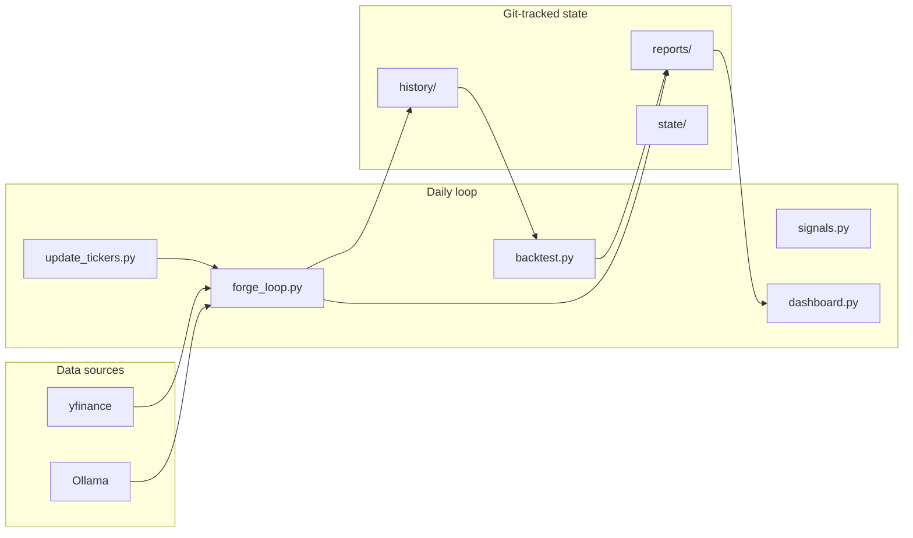

# OracleForge

A daily research pipeline that runs multiple **local Ollama models** against S&P 500 equities. Each model predicts the next session's **High of Day (HOD)** from the latest close and news headlines. Predictions are combined into a **score-weighted consensus**, classified as **WATCH / SKIP / AVOID**, backtested against realized prices, and viewable in a **Streamlit dashboard**.

This project does **not** place live trades.

## Quick start

```bash
pip install -r requirements.txt
python update_tickers.py                    # top 50 tickers
python forge_loop.py --tickers NVDA,AAPL    # fast watchlist run
python backtest.py                          # validate past predictions
streamlit run dashboard.py                  # visual UI
```

## How it works



## Commands

| Command | Purpose |
|---------|---------|
| `python update_tickers.py` | Refresh S&P 500 watchlist by market cap |
| `python forge_loop.py` | Full daily loop for all tickers in config |
| `python forge_loop.py --tickers NVDA,AAPL,MSFT` | **Watchlist mode** — only run selected symbols |
| `python signals.py` | Regenerate signals report from latest history |
| `python backtest.py` | Score all history vs next-day OHLC |
| `streamlit run dashboard.py` | Web UI for signals, scores, backtest |

### Backtest options

```bash
python backtest.py --from-date 2026-05-01 --to-date 2026-05-10
```

Output: `reports/backtest_summary.json` with win rate and average return % by **model** and by **signal** (WATCH / SKIP / AVOID / CONSENSUS).

### Signals thresholds

Edit [`config/signals.json`](config/signals.json):

```json
{
    "min_upside_pct": 1.5,
    "max_spread_pct": 3.0,
    "min_bullish_models": 2
}
```

| Signal | Meaning |
|--------|---------|
| **WATCH** | Consensus upside ≥ threshold, enough bullish models, tight spread |
| **SKIP** | Neutral — does not meet WATCH rules |
| **AVOID** | Consensus HOD below close |

## Dashboard

```bash
streamlit run dashboard.py
```

Tabs:

- **WATCH list** — sorted opportunities for the selected date
- **All tickers** — filterable table + per-ticker model chart
- **Model scores** — current MoE leaderboard
- **Backtest** — win rates from `backtest.py` (run backtest from UI if missing)

## Project layout

| Path | Purpose |
|------|---------|
| `forge_loop.py` | Main daily engine |
| `signals.py` | Consensus, WATCH/SKIP/AVOID, report CLI |
| `backtest.py` | Historical performance vs next-session OHLC |
| `dashboard.py` | Streamlit UI |
| `update_tickers.py` | S&P 500 universe refresh |
| `config/tickers.json` | Default symbol list |
| `config/signals.json` | Signal thresholds |
| `state/analyst_scores.json` | Model scores (0–10), weights consensus |
| `history/predictions_*.json` | Enriched daily predictions |
| `reports/signals_*.json` | Daily WATCH / SKIP / AVOID lists |
| `reports/backtest_summary.json` | Aggregated backtest metrics |
| `test_signals.py` / `test_backtest.py` | Unit tests |

## Prerequisites

- Python 3.12+
- [Ollama](https://ollama.com/) at `http://localhost:11434` for `forge_loop.py`
- Models in `state/analyst_scores.json` pulled locally (e.g. `ollama pull llama3.1:8b-instruct-q8_0`)

## Tests

```bash
python -m unittest test_signals.py test_backtest.py
```

## Automation

The [nightly workflow](.github/workflows/nightly_forge.yml) runs on weekdays (23:00 UTC) on a self-hosted `nvidia-gpu` runner: refresh **50** tickers → `forge_loop.py` → validate outputs → commit `config/`, `state/`, `history/`, `reports/`.

The workflow **fails loudly** if tickers are empty, inference produces no files, or there is nothing to commit (no more silent green runs with no data). A seeded `config/tickers.json` ensures Yahoo outages do not zero out the watchlist.

## Limitations

- Research only; not financial advice.
- Long-bias (target = HOD); no short logic.
- Backtest needs Yahoo data for the session after each prediction date.
- More history files → longer backtest runtime.

## License

MIT — see [LICENSE](LICENSE).
